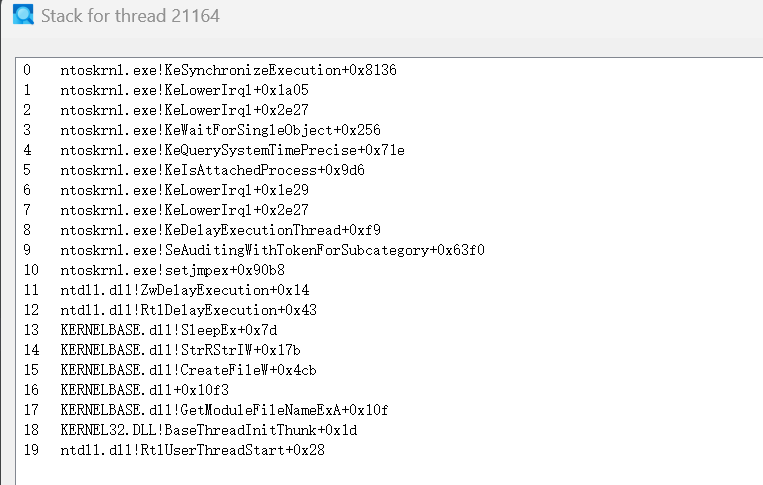

# Mirage

Mirage 是一个面向 Windows 10 x64 的轻量加载器/研究框架，聚焦于最小导入、间接系统调用与调用栈伪造，便于在不同环境中复用与替换 Payload。项目强调“可读、可控、可扩展”，方便在研究或红队演练中做快速验证与二次开发。

## 主要特性

- **间接系统调用**：基于 SysWhispers3 思路重构，通过 `syscall; ret` 进行间接跳转，绕过常规导入与 API 监控。
- **栈欺骗（Stack Spoofing）**：参考 SilentMoonwalk 的调用链伪造逻辑，模拟正常栈回溯路径。
- **DLL 脱钩**：从 KnownDlls 映射干净的 `ntdll.dll`，恢复 `.text` 段，降低 Inline Hook 影响。
- **ETW/CFG Patch**：针对 ETW 事件与 CFG 入口做最小改动补丁。
- **环境检查**：包含调试、全局标志、处理器数量、RDTSC 等多项判断。



## 代码结构

- `src/main.c`：模块定位、Gadget/栈帧选择、Syscall 表初始化。
- `src/engine.c`：Syscall/API 统一封装与参数封送。
- `src/loader.c`：环境检测、NTDLL 修复、ETW/CFG Patch 与 Payload 入口。
- `src/utils/gadgets.c`：Unwind 解析与 Gadget 搜索逻辑。
- `src/utils/pe_utils.c`：PE 导出表与哈希工具。
- `src/asm/`：Gate 与 Spoofer 汇编实现。
- `shtools/`：Shellcode 生成与提取工具（可选）。

## 构建

1. 使用 **x64 Native Tools Command Prompt for VS** 进入项目目录。
2. 运行：

```bat
build.bat
```

输出位于 `bin/MyLoader.exe`。

## 使用方式

- 在 `src/loader.c` 的 `Payload()` 中替换为实际逻辑（解密、映射、执行等）。
- 如需导入 Shellcode，可先在 `shtools/shellcode.c` 编写代码，然后运行 `shtools/build_shellcode.bat` 生成字节数组，再自行接入 `Payload()`。

## 兼容性与注意事项

- 主要针对 Windows 10 x64 测试，其他版本未完全验证。
- Release/Tiny 模式默认关闭日志输出（见 `include/common.h`）。
- 项目仅提供基础骨架，具体对抗策略需自行评估与调整。

## 免责声明

本项目仅供安全研究与授权测试使用。禁止用于任何非法用途。使用本项目造成的后果由使用者自行承担。

## 致谢

- **SilentMoonwalk** by [klezVirus](https://github.com/klezVirus) - Stack Spoofing
- **SysWhispers3** by [klezVirus](https://github.com/klezVirus) - Syscall
